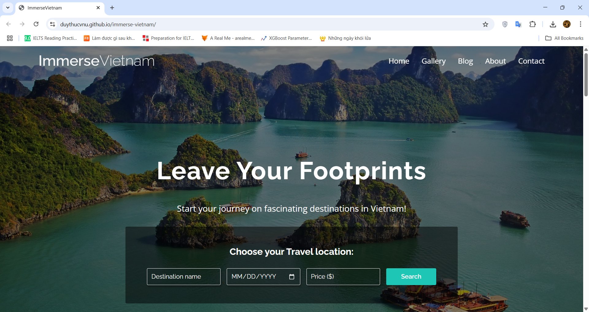

# ImmerseVietnam Website

A static website promoting Vietnam tourism, developed as the final project for the Web Authoring and Management course at VNU International School.

## Project Overview

ImmerseVietnam is a visually appealing and user-friendly website designed to showcase the beauty, culture, and attractions of Vietnam to a global audience. It serves as an advertising platform for the conceptual ImmerseVietnam travel agency, aiming to inspire travel and provide essential information for planning a trip.

The website features high-quality imagery, engaging content about various destinations, travel tips, and interactive elements to create an immersive experience for visitors.

**Live Demo:** https://duythucvnu.github.io/immerse-vietnam

## Getting Started

1.  **Clone the repository:**
    ```bash
    git clone https://github.com/duythucvnu/immerse-vietnam.git
    cd immerse-vietnam
    ```
2.  **Open `index.html`:** Navigate to the project directory and open the `index.html` file in your web browser.

## Video Demo
<p align="center">
  <a href="https://drive.google.com/file/d/1wTeAXR58vM2i6j8jS0icAWr_vW0uK47M/view?usp=sharing">
    
  </a>
</p>

## License

This project was developed for educational purposes as part of the Web Authoring and Management course at VNU International School.
